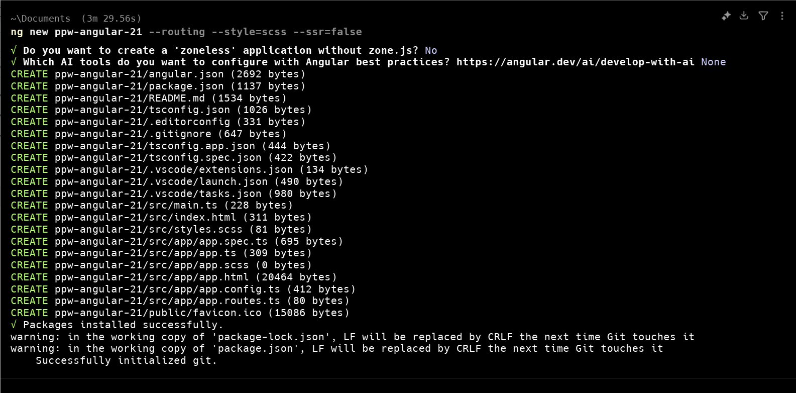
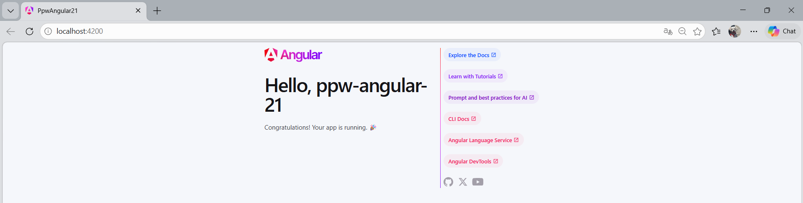
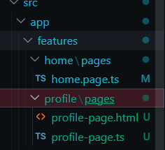
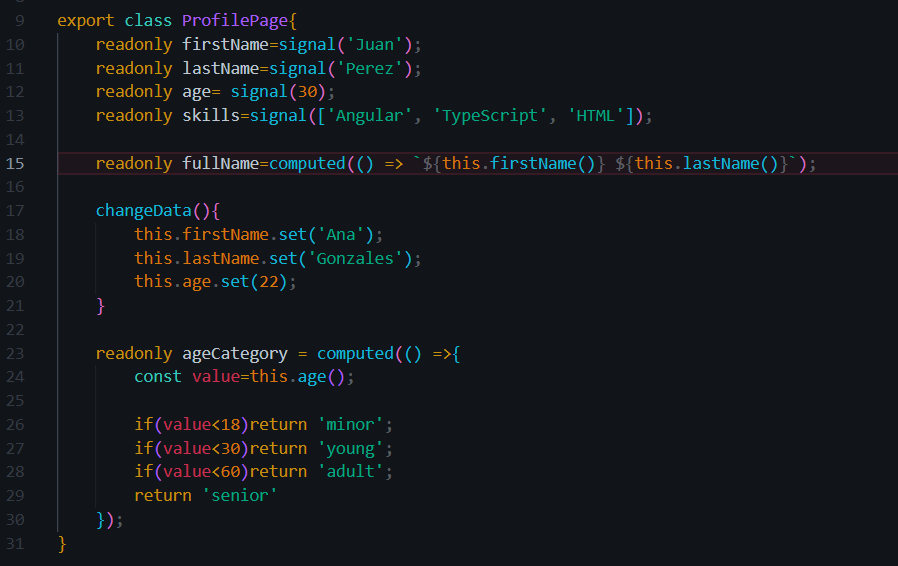
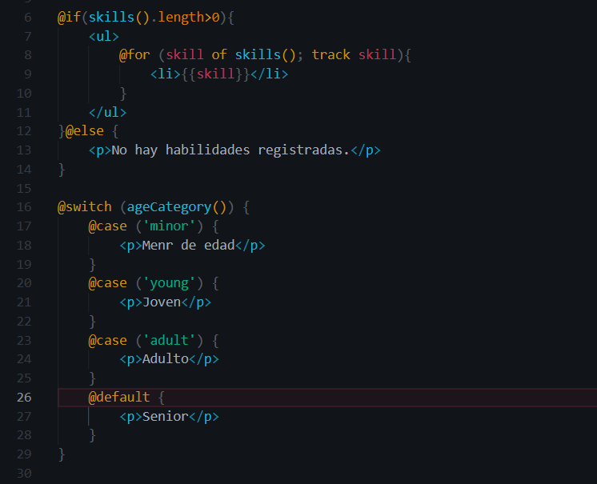
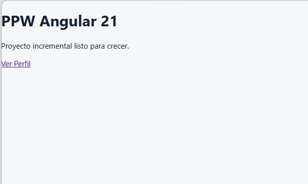
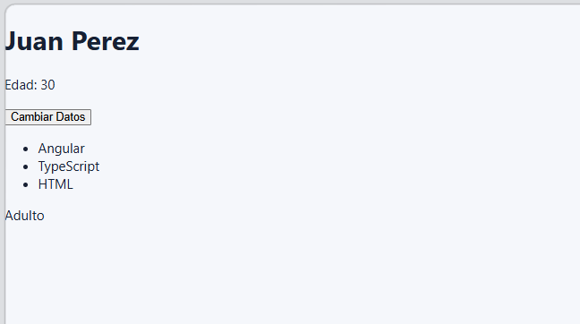

# Proyecto de Angular 

# Evindencias del 01-instalación

### 1. Salida de `ng version` en la terminal

### 2. Proceso de  creación del proyecto con Angular CLI

### 3. Pagina de bienvenida de Angular.

### 4. `HomePage` funcionando en `localHost:4200`

# Evidencias del 02-fundamentos-angular

### 1. Feature `profile` creada

### 2. Uso correcto de signals y `computed`

### 3. Uso correcto de `@if`, `@for` y `@switch`

### 4. Enlace visible a la página inicial y la nueva página 

