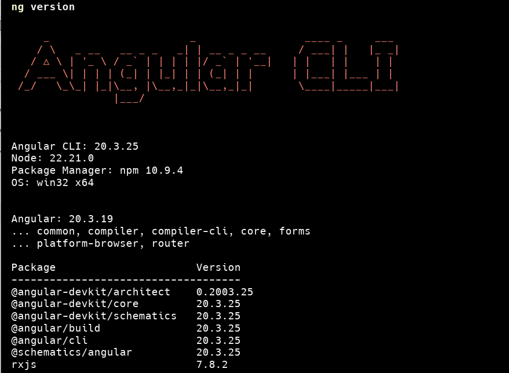
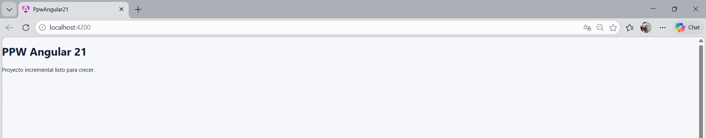

# Proyecto en su estado inicial

### Evindencias del 01-instalación

### 1. Salida de `ng version` en la terminal

### 2. Proceso de  creación del proyecto con Angular CLI

### 3. Pagina de bienvenida de Angular.

### 4. `HomePage` funcionando en `localHost:4200`

